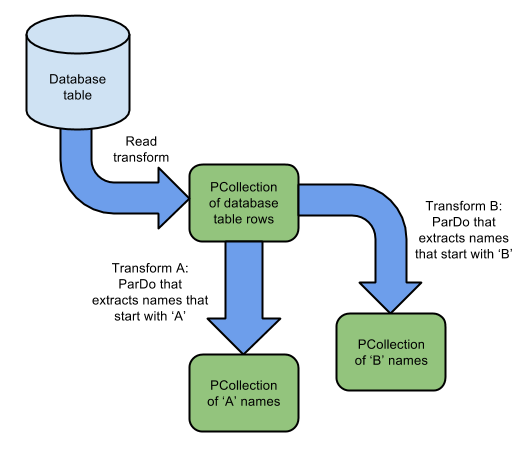
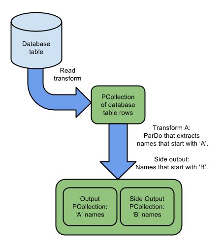

### Branching PCollections

transform 이 `PCollection`을 소비하지 않는다는 것을 이해하는것은 굉장히 중요합니다. 다시한번 말하지만, transform 은 `PCollection`안의 element 들 각각에 대해 고려하고, 새로운 `PCollection`을 출력합니다. 이 방법으로, 당신은 같은 `PCollection`안의 다른 element 들에 대해 다른 것들을 할 수 있습니다.

#### Multiple transforms process the same PCollection

당신은 `PCollection`을 변경하거나 소비하지 않고 여러 개의 transform을 사용하기 위해 입력으로 같은 `PCollection`을 사용할 수 있습니다.

아래의 파이프라인 그림은 단일 소스(데이터베이스 테이블)에서 입력을 받고, `PCollection`을 만들어냅니다. 이 같이, 파이프라인은 같은 `PCollection`에 대해 다수의 transform을 적용 합니다. transform A 는 `PCollection`에서 'A'로 시작하는 이름들을 추출하고, transform B는 'B'로 시작하는 것을 추출합니다. A, B 두 transform 은 같은 `PCollection` 입력을 받습니다.



> Figure 2: 여러 개의 transform 과 단일 파이프라인. 데이터베이스의 PCollection 은 두개의 transform 에 의해 실행됨을 확인하세요.

#### A single transform that uses side outputs

파이프라인을 가지 치는 또다른 방법은 [side output](https://beam.apache.org/documentation/programming-guide/#transforms-sideio)을 사용해 하나의 transform 으로  여러 출력 `PCollection`을 만드는 것입니다. side output 을 사용하는 transform 은, 하나의 입력에 대해 각각의 element에 대해서 수행하며, 0 혹은 다수의 `PCollection`을 만들어 낼 수 있습니다.

아래 그림은 위와 같은 역할을 나타내지만, side output 을 사용한 하나의 transform 을 사용합니다. 'A'로 시작하는 것들은 output `PCollection` 으로, 'B'로 시작하는 이름은 side output `PCollection`으로 추가됩니다.



> Figure 3: 다수의 PCollection 을 출력하는 단일 transform 을 사용하는 파이프라인

Figure2 의 파이프라인은 같은 입력 `PCollection`의 element 에 대해 수행하는 두개의 transform 을 포함합니다. 하나의 transform 은 다음의 논리 패턴을 사용합니다.
```
if (starts with 'A') { outputToPCollectionA }
```

다른 transform 은 다음과 같은 패턴입니다.
```
if (starts with 'B') { outputToPCollectionB }
```

왜냐하면 각각의 transform 은 전체 입력 `PCollection`을 읽고, 입력 `PCollection` 내의 각각의 element 는 두번씩 수행됩니다.

Figure3 의 파이프라인은 한번의 다음의 로직을 사용하는 하나의 transform 을 사용합니다.

```
if (starts with 'A') { outputToPCollectionA } else if (starts with 'B') { outputToPCollectionB }
```

입력 `PCollection`안의 element 각각이 한번씩 수행됩니다.

당신은 여러 출력 `PCollection`을 만들기 위해 두개의 매커니즘을 사용할 수 있습니다. 그러나, side output 을 사용하는것이 시간 측면에서 조금 더 이득을 볼 수 있습니다.
